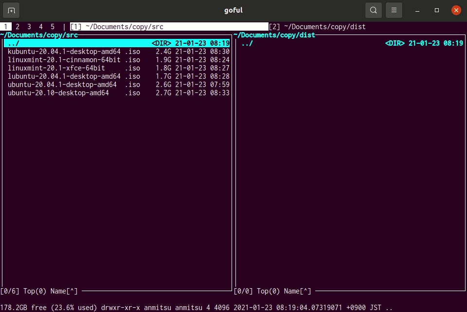
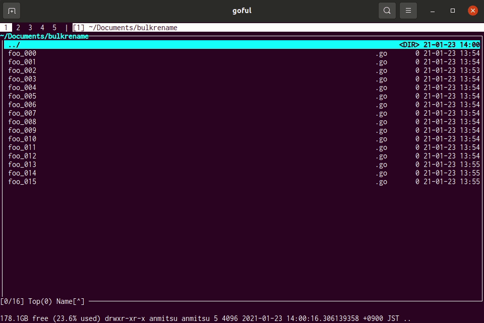
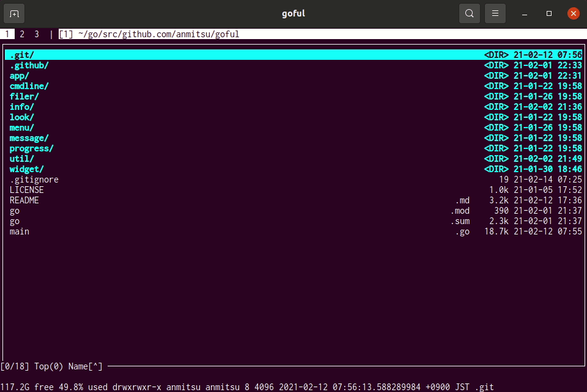
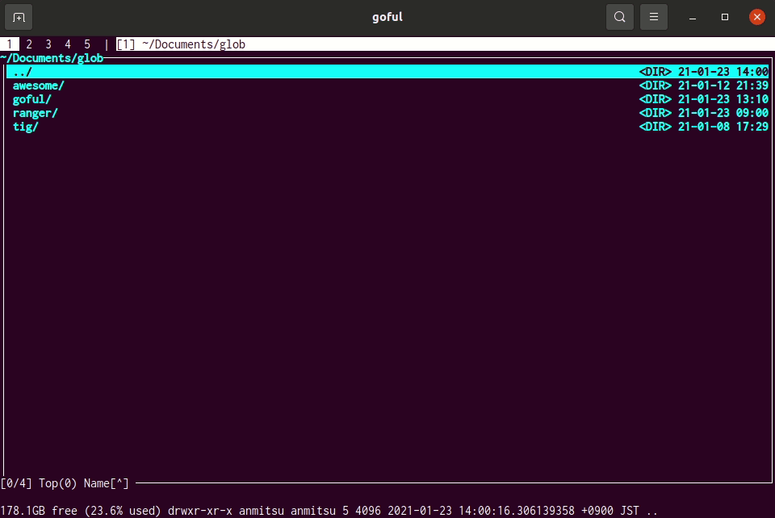
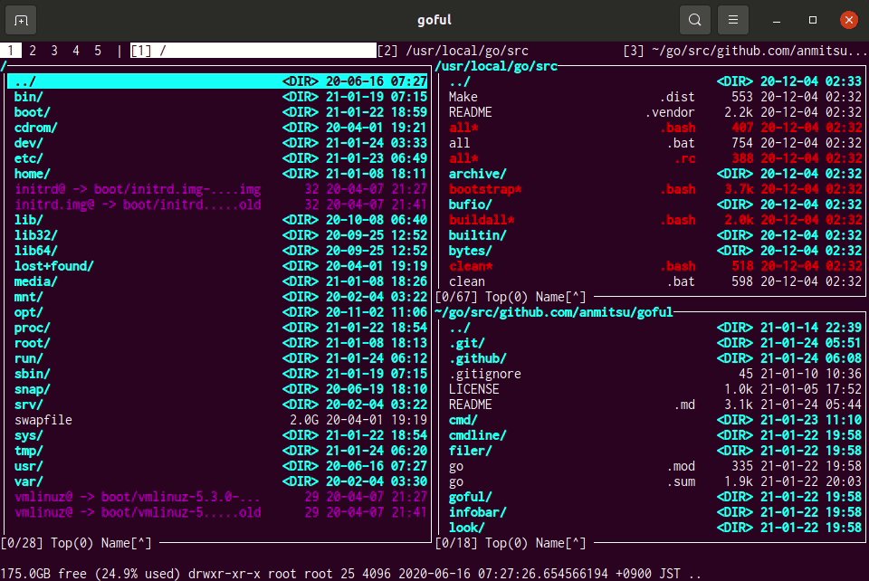
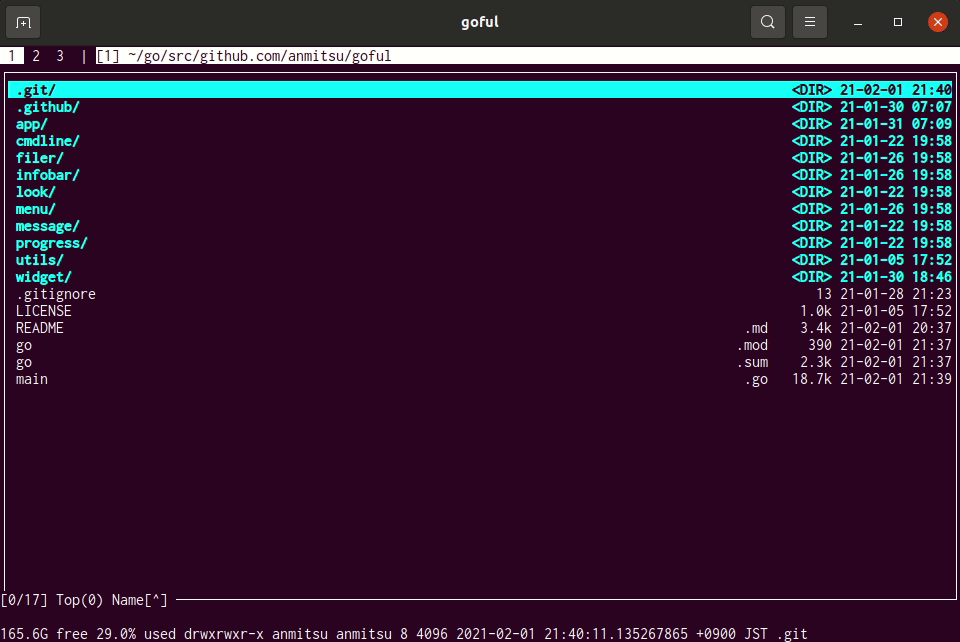
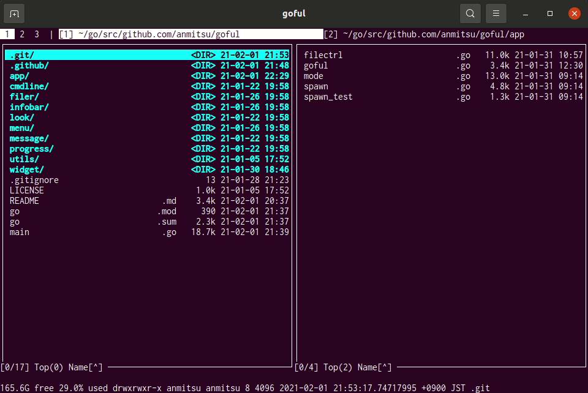

# Tutorial Demos

## Copy and Move

Copy (default `c`) and move (default `m`) mark (default `space` and invert
`C-space`) files.

First input a copy source file name (or path).  The default source is a file
name on the cursor.  If files are marked, this step is skipped.

Second input a copy destination path and start copy processing.  The default
destination is a neighboring directory path.

During processing draws copying file count, size and name, progress percent,
gauge, bps and estimated time of arrival.

If the source file type is a directory, recursively copy.  Also copy
modification time and permissions.

Rise a override confirm dialog `[y/n/Y/N]` if the name same as source file
exists in the destination.  This dialog means:

* `y` is overwrite only this file
* `n` is not overwrite only this file
* `Y` is overwrite all later file
* `N` is not overwrite all later file

Copy process works asynchronously.  And processed in the order if you run
multiple copies.

Note that copy process can not interrupt.  If you want to interrupt, please quit
the application (default `q` `Q`).

## Bulk Rename

Bulk renaming (default `R`) for mark (default `space` and invert `C-space`)
files.

Rename by the regexp pattern.  Input like the vim substituting style
(regexp/replaced).  Display and confirm matched files and replaced names before
rename.

## Finder (Filtering search)

The finder (default `f` `/`) filters files in the directory.

Input characters recognizes as the regexp.  Case insensitive when inputs
lowercase only, on the other hand case sensitive when contains uppercase.

Delete characters by `C-h` and `backspace` (default).  Can select input
histories by `M-p` and `M-n` (default).

Other than character inputs (exclude a space) and the finder keymap pass to the
main input.

Hit reset key (default `C-g` `C-[` means `Esc`) to clear filtering.

## Glob

Glob is matched by wild card pattern in the current directory (default `g` and
recursive `G`).

Hit reset key (default `C-g` `C-[` means `Esc`) to clear glob patterns.

## Layout

Directory windows position are allocated by layouts of tile, tile-top,
tile-bottom, one-row, one-column and fullscreen.

View menu (default `v`), run layout menu and select layout:

## Execute Terminal and Shell

Shell mode (default `:` and suspended `;`) runs a terminal and execute shell
such as bash and tmux.  The cmdline completion (file names and commands in
$PATH) is available (default `C-i` that means `tab`).

For example, spawns commands by bash in a gnome-terminal new tab:

The terminal immediately doesn't close when command finished because check
outputs.

If goful is running in tmux, it creates a new window and executes the command.

## Expand Macro

macro        | expanded string
-------------|------------------
`%f` `%F`   | File name/path on cursor
`%x` `%X`   | File name/path with extension excluded on cursor
`%m` `%M`   | Marked file names/paths joined by spaces
`%d` `%D`   | Directory name/path on cursor
`%d2` `%D2` | Neighbor directory name/path
`%~f` ...   | Expand by non quote
`%&`        | Flag to run command in background

The macro is useful if do not want to specify a file name when run the shell.

Macros starts with `%` are expanded surrounded by quote, and those starts with
`%~` are expanded by non quote.  The `%~` mainly uses to for cmd.exe.

Use `%&` when background execute the shell such as GUI apps launching.

<!-- demo size 120x35 -->