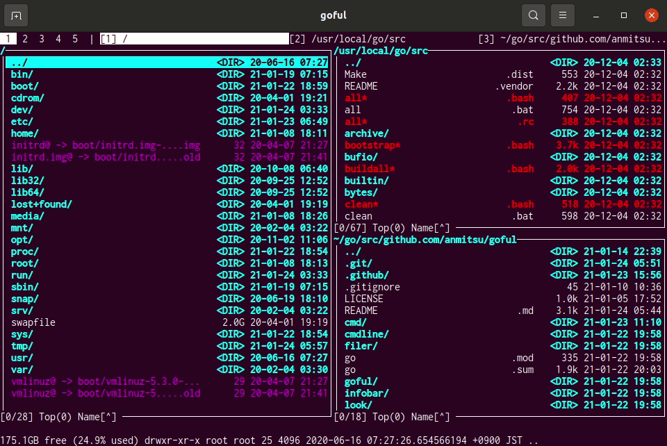

# Goful

Goful is a CUI file manager written in Go.

* Works on cross-platform such as gnome-terminal and cmd.exe.
* Displays multiple windows and workspaces.
* A command line to execute using such as bash and tmux.
* Provides filtering search, async copy, glob, bulk rename, etc.

For more [demos](.github/demo.md)

## Install

    $ go get github.com/anmitsu/goful
    ...
    $ goful

## Usage

| key                  | function |
-----------------------|-----------
| `C-n`, `down`, `j`   | Move cursor down |
| `C-p`, `up`, `k`     | Move cursor up |
| `C-a`, `home`, `^`   | Move cursor top |
| `C-e`, `end`, `$`    | Move cursor bottom |
| `C-f`, `C-i`, `right`, `l`| Move cursor right |
| `C-b`, `left`, `h`   | Move cursor left |
| `C-d`                | More move cursor down |
| `C-u`                | More move cursor up |
| `M-v`, `pgdn`        | Page down |
| `M-p`, `pgup`        | Page up |
| `M-n`                | Scroll down |
| `M-p`                | Scroll up |
| `C-h`, `backspace`, `u`| Change to upper directory |
| `~`                  | Change to home directory |
| `\`                  | Change to root directory |
| `w`                  | Change to neighbor directory |
| `C-o`                | New directory window |
| `C-w`                | Close directory window |
| `M-f`                | Move next workspace |
| `M-b`                | Move previous workspace |
| `M-C-o`              | New workspace |
| `M-C-w`              | Close workspace |
| `space`              | Mark file on cursor |
| `C-space`            | Toggle mark all files |
| `C-l`                | Reload files |
| `C-m`, `o`           | Open |
| `i`                  | Open by pager |
| `s`                  | Sort menu |
| `v`                  | View menu |
| `b`                  | Bookmark menu |
| `e`                  | Editor menu |
| `x`                  | Command menu |
| `X`                  | External command menu |
| `f`, `/`             | Find files |
| `:`                  | Start shell mode |
| `;`                  | Start shell suspend mode |
| `n`                  | Create new file |
| `K`                  | Create new directory |
| `c`                  | Copy file |
| `m`                  | Move file |
| `r`                  | Rename file |
| `R`                  | Bulk rename by regexp |
| `D`                  | Remove file |
| `d`                  | Change directory |
| `g`                  | Glob file |
| `G`                  | Glob directory |
| `C-g`, `esc`         | Cancel |
| `q`, `Q`             | Quit application |

For more see [main.go](main.go)

## Customize

Goful customizes by edit `main.go` and rebuild.

For example, install your customized binary to `$GOPATH/bin`.

    Clone source code
    $ git clone https://github.com/anmitsu/goful

    Copy original main.go to my/goful directory
    $ cd goful
    $ mkdir -p my/goful
    $ cp main.go my/goful
    $ cd my/goful
    
    After edited my/goful/main.go
    $ go install

## Contributing

[Contributing Guide](.github/CONTRIBUTING.md)
